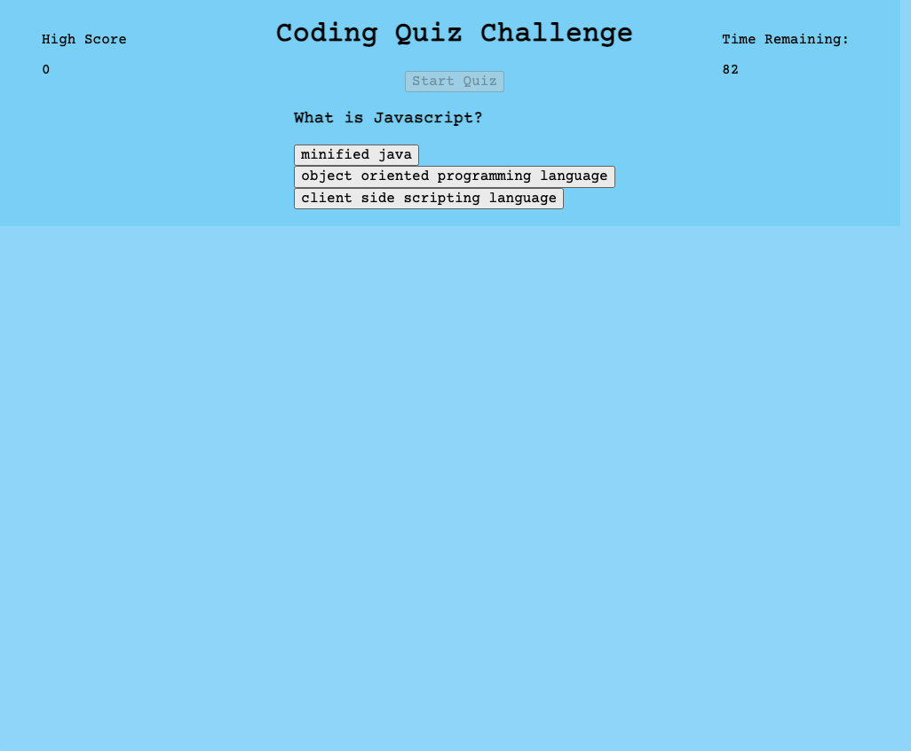

# Fourth Week Challenge -- Code Quiz

UofO Bootcamp 4th Week Challenge Exercise

## Usage

Using html, css, and javascript to create a multi-choice quiz that collects test scores onto DOM Local Storage

## Mockup

## Links

<a href="https://github.com/SevenRooT/04_Challenge_Web-APIs-Code-Quiz" target="_blank">GitHub Repository</a>

 <a href="https://sevenroot.github.io/04_Challenge_Web-APIs-Code-Quiz/" target="_blank">Live Code Quiz Page</a>

## License

[MIT](https://choosealicense.com/licenses/mit/)
